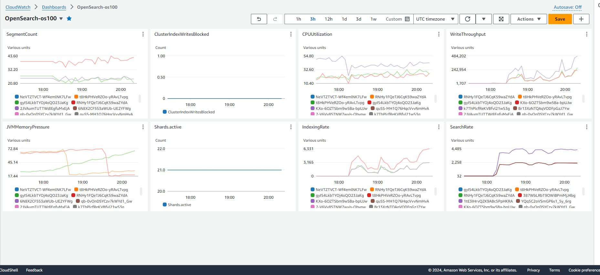

## Configure Your Open Search cluster
- Enter domain name
- Select deployment type 
- Used version 1.3 
- auto tune enabled
- 1 az, 3 nodes
- ebs storage, gp3
- 10 mb ebs storage per node
- disable fine grained access control
- Can make cluster public
- Configure domain access policy
  - elements - allow your ip address 
  - Allow your EC2 instance to run curl, python, etc
  - Add your laptop to access the dashboards
    -       "aws:SourceIp": "3.143.249.228/32"
    - see:
{
  "Version": "2012-10-17",
  "Statement": [
    {
      "Effect": "Allow",
      "Principal": {
        "AWS": "*"
      },
      "Action": "es:*",
      "Resource": "arn:aws:es:us-east-2:070201068661:domain/os100/*",
      "Condition": {
        "IpAddress": {
          "aws:SourceIp": [
            "3.143.249.228",
            "71.179.85.192",
            "18.222.101.119",
            "3.16.38.63"
          ]
        }
      }
    }
  ]
}
- Defaults for encryption options
- Create

## Changing access policy
- Cluster - Security configuration - Edit
- Change Deny to Allow

## Add another node
- Let it run through the Dry Run analysis
- If there are no errors, click Save and then cluster goes into Processing

## Create Kinesis Data Firehose Delivery Stream
See steps under ../KINESIS/readme.md for connecting KDFH to OpenSearch

## Log Generator

## OpenSearch health
```
curl -XGET "https://search-os110-c464qrmmf637vk7iy3jaijtzdq.us-east-2.es.amazonaws.com/_cluster/health?pretty=true"
curl -XGET "https://search-os110-c464qrmmf637vk7iy3jaijtzdq.us-east-2.es.amazonaws.com/_aliases?pretty=true"
curl -XGET "https://search-os110-c464qrmmf637vk7iy3jaijtzdq.us-east-2.es.amazonaws.com/_cat/indices?v"
% curl  -XGET "https://search-os100-r2nzbuvapidbpw36nzem54ma7q.us-east-2.es.amazonaws.com/_cat/indices"
green open .opendistro-reports-definitions kGlSpXd1QD6TRYIdaP-d3Q 1 2       0 0    624b    208b
green open conncar                         lLACjx3ORzSe4gfoJZoltA 2 1 1732895 0 804.6mb   402mb
green open .opendistro-reports-instances   EYJcp1u9T0eG9-DkItoG5g 1 2       0 0    624b    208b
green open .kibana_1                       PD2yg2vKS0O8twjqoMbZtA 1 2      45 8 157.6kb  52.5kb
green open c1                              SQXZllrbQneoCb514zMZxA 2 1     594 4 327.5kb 163.7kb
green open c2                              3mNWki9JRvSMNpN8KFicng 2 1    2500 0   2.4mb   1.2mb

% curl -XGET "https://search-os100-r2nzbuvapidbpw36nzem54ma7q.us-east-2.es.amazonaws.com/_cluster/health/conncar?pretty=true"
{
  "cluster_name" : "070201068661:os100",
  "status" : "green",
  "timed_out" : false,
  "number_of_nodes" : 3,
  "number_of_data_nodes" : 3,
  "discovered_master" : true,
  "active_primary_shards" : 2,
  "active_shards" : 4,
  "relocating_shards" : 0,
  "initializing_shards" : 0,
  "unassigned_shards" : 0,
  "delayed_unassigned_shards" : 0,
  "number_of_pending_tasks" : 0,
  "number_of_in_flight_fetch" : 0,
  "task_max_waiting_in_queue_millis" : 0,
  "active_shards_percent_as_number" : 100.0
}

# size of shards
% curl  -XGET "https://search-os100-r2nzbuvapidbpw36nzem54ma7q.us-east-2.es.amazonaws.com/_cat/shards?v" | grep conncar
conncar                         1     r      STARTED 866430 206.1mb x.x.x.x 8baded6a4871a6761858c5a056cd1753
conncar                         1     p      STARTED 866430 200.9mb x.x.x.x 071526ad709dad1f42038f222b9670be
conncar                         0     p      STARTED 866465 201.1mb x.x.x.x  ca6103dbc3ad14de619ee32ff18cd2ba
conncar                         0     r      STARTED 866465 216.2mb x.x.x.x 071526ad709dad1f42038f222b9670be


```


## Create index explicitly
```
curl  -XPUT 'https://search-os100-r2nzbuvapidbpw36nzem54ma7q.us-east-2.es.amazonaws.com/c1/?pretty=true' -H 'Content-Type: application/json' -d @"c1.mapping"
c1.mapping:
{
  "settings": {
    "index": {
      "number_of_shards": 2,
      "number_of_replicas": 1
    }
  },
  "mappings": {
    "properties" : {
    "messageId": {
      "type": "text"
    },
    "metadata_generatedAt" : {
      "type" : "date",
      "format": "MM/dd/yyyy hh:mm:ss"
    }
  }
  }
}
```

# insert a doc
Note this matches the index built above especially for the metadata_generatedAt field
```
curl  -XPOST "https://search-os100-r2nzbuvapidbpw36nzem54ma7q.us-east-2.es.amazonaws.com/c1/_doc" -H 'Content-Type: application/json' -d '
 {"metadata_generatedAt": "10/18/2017 03:48:52",
  "metadata_recordGeneratedBy": "OBU",
  "metadata_logFileName": "rxMsg_1508341730_2001_470_11_456_226_adff_fe05_14b1.csv"
 }
'
```

## Bulk load from json file
```
curl  -H "Content-Type: application/json" -XPOST "https://search-os200-3upgw4tibkrffdnhn6irnvfwoa.us-east-2.es.amazonaws.com/_bulk" --data-binary @taylor2.json
# json must look like:
{"index" : { "_index" : "idxname", "_id" : 1000 }}
{json stuff}
{"index" : { "_index" : "idxname", "_id" : 1001 }}
{json stuff}
```
- idxname must be all lower case
- loader creates the index


## OpenSearch index specific queries
```
# return all data from index c2
curl -XGET "https://search-os100-r2nzbuvapidbpw36nzem54ma7q.us-east-2.es.amazonaws.com/c2/_search?pretty=true&q=*:*"

# see mapping of index
curl  -XGET "https://search-os100-r2nzbuvapidbpw36nzem54ma7q.us-east-2.es.amazonaws.com/c2/_mapping?pretty=true"

curl -XGET 'https://search-tts-os-300-tdlizichjv6yimvvoj4cnexaua.us-east-2.es.amazonaws.com/weblogs-*/_search?q=get' | jq
curl -XGET 'https://search-tts-os-300-tdlizichjv6yimvvoj4cnexaua.us-east-2.es.amazonaws.com/weblogs*/_search?q=host:80.127.116.96' | jq
curl -XGET 'https://search-tts-os-300-tdlizichjv6yimvvoj4cnexaua.us-east-2.es.amazonaws.com/weblogs*/_search?q=response:400' | jq
curl -XGET 'https://search-tts-os-300-tdlizichjv6yimvvoj4cnexaua.us-east-2.es.amazonaws.com/weblogs*/_count'
{"count":349276,"_shards":{"total":10,"successful":10,"skipped":0,"failed":0}}
curl -XGET 'https://search-tts-os-300-tdlizichjv6yimvvoj4cnexaua.us-east-2.es.amazonaws.com/_cat/indices/web*'
curl -XGET 'https://search-tts-os-300-tdlizichjv6yimvvoj4cnexaua.us-east-2.es.amazonaws.com/web*/_stats' | jq
curl -XPUT -u 'admin:Pass' \
  'https://search-ttsheng-opensearch-100-gxza6jvpr67ioemyyqqj7fkoxy.us-east-2.es.amazonaws.com/voicemail'
curl -XGET -u 'admin:Pass' \
  'https://search-ttsheng-opensearch-100-gxza6jvpr67ioemyyqqj7fkoxy.us-east-2.es.amazonaws.com/voicemail'
curl -XGET -u 'admin:Pass' \
  'https://search-ttsheng-opensearch-100-gxza6jvpr67ioemyyqqj7fkoxy.us-east-2.es.amazonaws.com/voicemail/_search?q-get'
curl -X DELETE -u 'admin:Pass' \
'https://search-ttsheng-opensearch-100-gxza6jvpr67ioemyyqqj7fkoxy.us-east-2.es.amazonaws.com/voicemail/'
#insert single doc
curl -XPOST 'https://search-os110-c464qrmmf637vk7iy3jaijtzdq.us-east-2.es.amazonaws.com/swift/_doc/1' -d '{"title":"test", "Album":"test","Lyric":"test"}'  -H 'Content-Type: application/json'
# count docs
curl -XGET "https://search-os110-c464qrmmf637vk7iy3jaijtzdq.us-east-2.es.amazonaws.com/swift/_count?pretty=true"
# query keyword
curl -XGET "https://search-os110-c464qrmmf637vk7iy3jaijtzdq.us-east-2.es.amazonaws.com/swift/_search?q=magic&pretty"
curl -XGET "https://search-os110-c464qrmmf637vk7iy3jaijtzdq.us-east-2.es.amazonaws.com/swift/_search?q=sad&pretty"

```

## Date specific queries
```
curl -XGET "https://search-os100-r2nzbuvapidbpw36nzem54ma7q.us-east-2.es.amazonaws.com/c1/_search?pretty=true" -H 'Content-Type: application/json' -d'
{
  "query": {
    "range": {
      "metadata_generatedAt": {
        "gte": "10/04/2024 03:00:00",
        "lte": "10/05/2024 12:00:00",
        "format": "MM/dd/yyyy HH:mm:ss",
        "relation" : "within"
      }
    }
  }
}'
```

## Other query stuff
```
curl -XGET "https://search-os100-r2nzbuvapidbpw36nzem54ma7q.us-east-2.es.amazonaws.com/conncar/conncar/_search?pretty=true" -H 'Content-Type: application/json' -d' { "query": { "match": { "metadata_recordGeneratedBy": "SEA" } } } '


```

## Working with date fields
- Create the index explicitly with the date field formatted 
- Load data either in bulk or interactively with the correct formatted date
- The issue is that OS can create the index with a string instead of a date
- In the OS dashboard, go to Stack Management..Index Patterns and create an index pattern on your collection. It should find the date field correctly.

## Delete Index
```
curl  -X DELETE "https://search-os200-3upgw4tibkrffdnhn6irnvfwoa.us-east-2.es.amazonaws.com/taylor2"
{"acknowledged":true}
```

## CLI
```
aws opensearch create-domain --domain-name mylogs --engine-version OpenSearch_2.11 --cluster-config  InstanceType=r6g.large.search,InstanceCount=2 --ebs-options EBSEnabled=true,VolumeType=gp3,VolumeSize=100,Iops=3500,Throughput=125 --access-policies '{"Version": "2012-10-17", "Statement": [{"Action": "es:*", "Principal":"*","Effect": "Allow", "Condition": {"IpAddress":{"aws:SourceIp":["3.143.249.228/32", "myip/32"]}}}]}'

aws opensearch describe-domains --domain-names os100 | jq ' .DomainStatusList[] | .ClusterConfig '
```

## Dashboard
Once your data has been loaded, create an index for the dashboard:
- go to your dashboard
- on the left, click Dashboards Management
- on the left, click Index Patterns
- enter your index pattern name, click Create Index pattern
- go back to Dashboard..Discover
- your index pattern that you just created should now show up in the dropdown in the left panel
After loading data [Swift, Airbnb] in bulk:
- Dashboards Management
  - Index patterns
    - Create index pattern

## Cluster Sizing
- Choosing number of shards
  - https://docs.aws.amazon.com/opensearch-service/latest/developerguide/sizing-domains.html#bp-sharding
  - goal is to distribute an index evenly across all data nodes in the cluster but not too large or numerous
  - keep shard size between 
    - 10-30 GiB for search
    - 30-50 GiB for write heavy such as log analytics

For example, suppose you have 66 GiB of data. You don't expect that number to increase over time, and you want to keep your shards around 30 GiB each. Your number of shards therefore should be approximately 66 * 1.1 / 30 = 3. You can generalize this calculation as follows:

(Source data + room to grow) * (1 + indexing overhead) / desired shard size = approximate number of primary shards

## Troubleshooting
- Enable logs
- Why is my cluster yellow
  - The primary shards for all indices are allocated to nodes in your cluster. However, one ore more replica shards aren't allocated to any of the nodes
  - List the unassigned shard:
```    
curl -XGET 'domain-endpoint/_cat/shards?h=index,shard,prirep,state,unassigned.reason' | grep UNASSIGNED
```
  - Get details for why
```
curl -XGET 'domain-endpoint/_cluster/allocation/explain?pretty' -H 'Content-Type:application/json' -d'{
     "index": "<index name>",
     "shard": <shardId>,
     "primary": <true or false>
}
```
- Not enough nodes to allocate to the shards
- Low disk space or disk skew
- JVM memory pressure
  - https://repost.aws/knowledge-center/opensearch-high-jvm-memory-pressure
  - https://docs.aws.amazon.com/opensearch-service/latest/developerguide/handling-errors.html#handling-errors-red-cluster-status-heavy-processing-load
- Reduce JVM memory pressure first
- Tips to bring cluster back to green
  - Increase default shard retry value from 5 to higher
  - Deactivate and activate replica shard
  - Manually retry the unassigned shards
- "Message":"Request size exceeded 10485760 bytes"
  - Instance size too small - https://docs.aws.amazon.com/opensearch-service/latest/developerguide/limits.html
  - Maximum size of http request payloads - all t2/3s have 10MiB https payload limit
- JVM garbage collection
- JVM thread pool

## Snapshots
- create s3 bucket
- create iam role
- register a repository to keep the manual snapshots
- don't need to do this for automated snaps
  - For domains running OpenSearch or Elasticsearch 5.3 and later, OpenSearch Service takes hourly automated snapshots and retains up to 336 of them for 14 days. Hourly snapshots are less disruptive because of their incremental nature. They also provide a more recent recovery point in case of domain problems
```
curl -PUT "https://search-os100-r2nzbuvapidbpw36nzem54ma7q.us-east-2.es.amazonaws.com/_snapshot/os100.1"
'{
  "type": "s3",
  "settings": {
    "bucket": "ttsheng-os-snaps",
    "region": "us-east-2",
    "role_arn": "arn:aws:iam::070201068661:role/admin"
  }
}'
```
- snaps not done from the console
```
curl -XGET 'domain-endpoint/_snapshot/_status'
curl -XPUT 'domain-endpoint/_snapshot/repository-name/snapshot-name'

curl -XGET "https://search-os100-r2nzbuvapidbpw36nzem54ma7q.us-east-2.es.amazonaws.com/_snapshot?pretty=true"
{
  "cs-automated-enc" : {
    "type" : "s3"
  }
}

curl -XGET "https://search-os100-r2nzbuvapidbpw36nzem54ma7q.us-east-2.es.amazonaws.com/_snapshot/cs-automated-enc/_all?pretty=true"
 {
    "snapshot" : "2024-04-13t01-55-20.17a45474-f514-b725-6c44-bc38e19be2c5",
    "uuid" : "RUebCI9MS8qkYUgdIqoA2Q",
    "version_id" : 136327827,
    "version" : "2.11.0",
    "remote_store_index_shallow_copy" : false,
    "indices" : [ "c1", "swift", "conncar", ".opendistro-reports-definitions", ".opendistro-reports-instances", ".kibana_1", "knn_index", "openai_wikipedia_index", "headset_pqa", ".opensearch-observability", "aoss-index", ".plugins-ml-config", "nlp_pqa", ".opensearch-sap-log-types-config", ".kibana_2", "c2" ],
    "data_streams" : [ ],
    "include_global_state" : true,
    "state" : "SUCCESS",
    "start_time" : "2024-04-13T01:55:19.971Z",
    "start_time_in_millis" : 1712973319971,
    "end_time" : "2024-04-13T01:55:25.378Z",
    "end_time_in_millis" : 1712973325378,
    "duration_in_millis" : 5407,
    "failures" : [ ],
    "shards" : {
      "total" : 47,
      "failed" : 0,
      "successful" : 47
    }
  }
```


- to restore a snap
  - identify the repository
    - curl -XGET 'domain-endpoint/_snapshot?pretty'
  - see all the snaps
    - curl -XGET 'domain-endpoint/_snapshot/repository-name/_all?pretty'
  - delete all the indexes
    -  curl -XDELETE 'domain-endpoint/_all'
  - or delete the single index
    - curl -XDELETE 'domain-endpoint/index-name'
  - restore
    - restore single index
```
    curl -XPOST 'domain-endpoint/_snapshot/cs-automated/2020-snapshot/_restore' \
-d '{"indices": "my-index"}' \
-H 'Content-Type: application/json'

   - restore all indexes except the dashboarrds and fgac indexes
curl -XPOST 'domain-endpoint/_snapshot/cs-automated/2020-snapshot/_restore' \
-d '{"indices": "-.kibana*,-.opendistro*"}' \
-H 'Content-Type: application/json'
```
## CLI
```
aws opensearch describe-domains --domain-names os100

aws opensearch update-domain-config --cluster-config  --no-dry-run
{
  "InstanceType": "t3.medium.search"
  # "InstanceType": "m5.large.search"
}
```

## Opensearchsql
https://github.com/opensearch-project/sql

```
select travelerdataframe_name, metadata_recordGeneratedBy, metadata_generatedAt from conncar where travelerdataframe_name != '' and metadata_recordGeneratedBy = 'SYD';
fetched rows / total rows = 200/200
+--------------------------+------------------------------+------------------------+
| travelerdataframe_name   | metadata_recordGeneratedBy   | metadata_generatedAt   |
|--------------------------+------------------------------+------------------------|
| Serenity                 | SYD                          | 2024-01-08 20:01:09    |
| Willow                   | SYD                          | 2024-01-01 10:01:03    |
| Charlotte                | SYD                          | 2024-01-01 21:01:59    |
| Iris                     | SYD                          | 2024-01-05 04:01:25    |
| Nathan                   | SYD                          | 2024-01-23 22:01:44    |
| Emilia                   | SYD                          | 2024-01-09 17:01:24    |
| Liliana                  | SYD                          | 2024-01-08 02:01:13    |
| Nolan                    | SYD                          | 2024-01-23 18:01:50    |
| Austin                   | SYD                          | 2024-01-11 05:01:51    |

opensearchsql https://search-os100-r2nzbuvapidbpw36nzem54ma7q.us-east-2.es.amazonaws.com/ -q "select travelerdataframe_name, metadata_recordGeneratedBy, metadata_generatedAt from conncar where travelerdataframe_name != ''"
```
## Perf Tuning
```
[ec2-user@ip-10-0-2-111 ~]$ curl  -XGET "https://search-os100-r2nzbuvapidbpw36nzem54ma7q.us-east-2.es.amazonaws.com/conncar/_settings?pretty=true"
{
  "conncar" : {
    "settings" : {
      "index" : {
        "creation_date" : "1708448861964",
        "number_of_shards" : "2",
        "number_of_replicas" : "1",
        "uuid" : "lLACjx3ORzSe4gfoJZoltA",
        "version" : {
          "created" : "135248027"
        },
        "provided_name" : "conncar"
      }
    }
  }
}

[ec2-user@ip-10-0-2-111 ~]$ curl  -XPUT "https://search-os100-r2nzbuvapidbpw36nzem54ma7q.us-east-2.es.amazonaws.com/conncar/_settings"  -H 'Content-Type: application/json' -d ' {
    "index" : {
        "refresh_interval" : "60s"
    }
}'
```

## CloudWatch Dashboard Sample


## Upgrade


