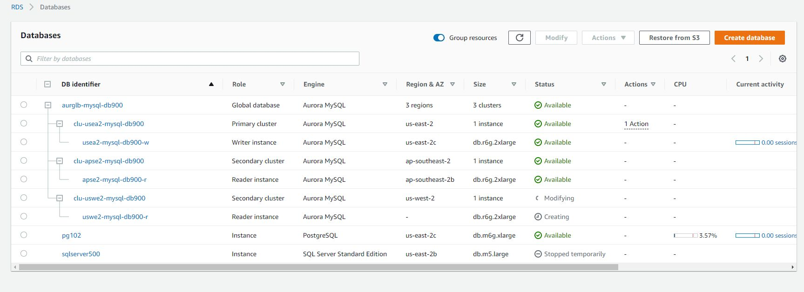

## Aurora Global and Write Forwarding
### Aurora Global Setup
- https://docs.aws.amazon.com/AmazonRDS/latest/AuroraUserGuide/aurora-global-database-write-forwarding.html 
- Note global cluster and regional clusters
- One writer in primary cluster and many readers
- In the console, create an Aurora cluster in your primary region.
  - Then Add Region which will add a second region and turn your cluster into a global cluster.


- Some cli commands
```
aws rds describe-db-engine-versions --engine aurora-mysql  --query 'DBEngineVersions[].ValidUpgradeTarget[].[Engine,EngineVersion]'
aws rds create-global-cluster --global-cluster-identifier aurg-mysql-100 \
  --engine aurora-mysql --engine-version 8.0.mysql_aurora.3.02.2 --region us-east-2

aws rds create-global-cluster --global-cluster-identifier aurg-mysql-200 --engine aurora-mysql --engine-version 8.0.mysql_aurora.3.02.2 --region us-east-2
aws rds create-db-cluster --global-cluster-identifier aurg-mysql-200 \
  --db-cluster-identifier  aurg-mysql-200-us-e2 \
  --engine aurora-mysql --engine-version 8.0.mysql_aurora.3.02.2  \
  --master-username admin --master-user-password pw \
  --region us-east-2 --vpc-security-group-ids sg-0ec060f989b5efc55

aws rds create-db-instance --db-cluster-identifier aurg-mysql-100-us-e2 \
  --db-instance-identifier aurg-mysql-100-us-e2-100 \
  --db-instance-class db.r5.large \
  --engine aurora-mysql --engine-version 8.0.mysql_aurora.3.02.2 \
  --region us-east-2

aws rds create-db-instance --db-cluster-identifier aurg-mysql-100-us-e2 \
  --db-instance-identifier aurg-mysql-100-us-e2-200 \
  --db-instance-class db.r5.large \
  --engine aurora-mysql --engine-version 8.0.mysql_aurora.3.02.2 \
  --region us-east-2

aws rds create-db-instance --db-cluster-identifier aurg-mysql-100-us-e2 \
  --db-instance-identifier aurg-mysql-100-us-e2-300 \
  --db-instance-class db.r5.large \
  --engine aurora-mysql --engine-version 8.0.mysql_aurora.3.02.2 \
  --region us-east-2 --vpc-security-group-ids sg-0ec060f989b5efc55 
aws rds create-db-cluster --global-cluster-identifier aurg-mysql-100 \
  --db-cluster-identifier  aurg-mysql-100-ap-se2 \
  --engine aurora-mysql --engine-version 8.0.mysql_aurora.3.02.2  \
  --region ap-southeast-2
  | --enable-global-write-forwarding
aws rds create-db-instance --db-cluster-identifier aurg-mysql-100-ap-se2 \
  --db-instance-identifier aurg-mysql-100-ap-se2-200 \
  --db-instance-class db.r5.large \
  --engine aurora-mysql --engine-version 8.0.mysql_aurora.3.02.2 \
  --region ap-southeast-2

aws rds create-db-instance --db-cluster-identifier aurg-mysql-100-ap-se2 \
  --db-instance-identifier aurg-mysql-100-ap-se2-100 \
  --db-instance-class db.r5.large \
  --engine aurora-mysql --engine-version 8.0.mysql_aurora.3.02.2 \
  --region ap-southeast-2

aws rds modify-db-cluster --db-cluster-identifier aurg-mysql-100-ap-se2 \
  --region ap-southeast-2 \
  --enable-global-write-forwarding
aws rds describe-db-clusters --query '*[].{DBClusterIdentifier:DBClusterIdentifier,GlobalWriteForwardingStatus:GlobalWriteForwardingStatus}' --region ap-southeast-2

[ec2-user@ip-10-0-2-111 ~]$ for region in us-east-1 us-east-2 ap-southeast-2; do aws rds describe-db-instances --query 'DBInstances[].Endpoint[]' --region $region; done
[
    {
        "Address": "clu-usea1-mysql-db900-r.c93uuztwxxsv.us-east-1.rds.amazonaws.com",
        "Port": 3306,
        "HostedZoneId": "Z2R2ITUGPM61AM"
    },
    {
        "Address": "neptunedbinstance-od7q4irkakwq.c93uuztwxxsv.us-east-1.neptune.amazonaws.com",
        "Port": 8182,
        "HostedZoneId": "ZUFXD4SLT2LS7"
    }
]
[
    {
        "Address": "clu-usea2-mysql-db900-w.cyt4dgtj55oy.us-east-2.rds.amazonaws.com",
        "Port": 3306,
        "HostedZoneId": "Z2XHWR1WZ565X2"
    },
    {
        "Address": "pg102.cyt4dgtj55oy.us-east-2.rds.amazonaws.com",
        "Port": 5432,
        "HostedZoneId": "Z2XHWR1WZ565X2"
    },
    {
        "Address": "sqlserver500.cyt4dgtj55oy.us-east-2.rds.amazonaws.com",
        "Port": 1433,
        "HostedZoneId": "Z2XHWR1WZ565X2"
    }
]
[
    {
        "Address": "clu-apse2-mysql-db900-r.cighaawlyk1n.ap-southeast-2.rds.amazonaws.com",
        "Port": 3306,
        "HostedZoneId": "Z32T0VRHXEXS0V"
    }
]
```
  - Note there are no user credentials when creating a secondary cluster
  - The first instance you create in the cluster is the writer.
  - All subsequent ones will be readers.
  - You can create more than one regional cluster at a time. 
  - You must remove a node/cluster from the region that it is in.
  - Remove a cluster from the global cluster by promoting it to a stand alone.
  - Console may get a little confused based on global vs regions.
###Testing write forwarding
```
MySQL [(none)]> use ttsheng;
Reading table information for completion of table and column names
You can turn off this feature to get a quicker startup with -A

Database changed
MySQL [ttsheng]>  set aurora_replica_read_consistency = 'eventual';
Query OK, 0 rows affected (0.00 sec)

MySQL [ttsheng]> select * from t1;
+------+------+
| col1 | col2 |
+------+------+
|    1 |    2 |
+------+------+
1 row in set (0.00 sec)

MySQL [ttsheng]> insert into t1 values (99,99); select * from t1;
Query OK, 1 row affected (0.19 sec)
-- this looks like you write an insert to a read replica!!
+------+------+
| col1 | col2 |
+------+------+
|    1 |    2 |
+------+------+
1 row in set (0.00 sec)

MySQL [ttsheng]> select * from t1;
+------+------+
| col1 | col2 |
+------+------+
|    1 |    2 |
|   99 |   99 |
+------+------+
2 rows in set (0.01 sec)
-- wait a few seconds to run the select again - propogated from the writer
```

