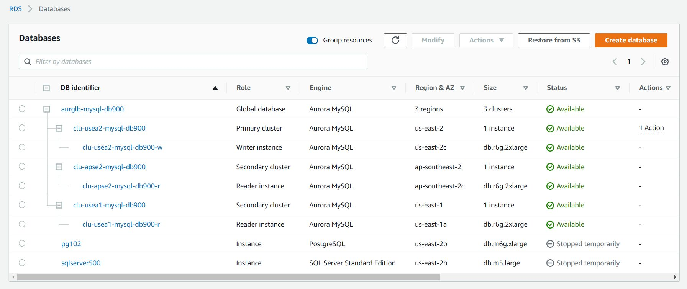

- Aurora Global and Write Forwarding
  - https://docs.aws.amazon.com/AmazonRDS/latest/AuroraUserGuide/aurora-global-database-write-forwarding.html 
  - Note global cluster and regional clusters
  - One writer in primary cluster and many readers
  - In the console, create an Aurora cluster in your primary region.
    - Then Add Region which will add a second region and turn your cluster into a global cluster.

  - List engines available for aurora-mysql - note global write forwarding is only available for mysql
```
aws rds describe-db-engine-versions --engine aurora-mysql  --query 'DBEngineVersions[].ValidUpgradeTarget[].[Engine,EngineVersion]'
```
  - Create overall global database
    - Note that you can't specify a specific VPC for these - so it will create in the default VPC.
```
aws rds create-global-cluster --global-cluster-identifier aurg-mysql-100 \
  --engine aurora-mysql --engine-version 8.0.mysql_aurora.3.02.2 --region us-east-2

aws rds create-global-cluster --global-cluster-identifier aurg-mysql-200 --engine aurora-mysql --engine-version 8.0.mysql_aurora.3.02.2 --region us-east-2
```
  - Create primary cluster in same region as the global database
```
aws rds create-db-cluster --global-cluster-identifier aurg-mysql-200 \
  --db-cluster-identifier  aurg-mysql-200-us-e2 \
  --engine aurora-mysql --engine-version 8.0.mysql_aurora.3.02.2  \
  --master-username admin --master-user-password pw \
  --region us-east-2 --vpc-security-group-ids sg-0ec060f989b5efc55

aws rds create-db-instance --db-cluster-identifier aurg-mysql-100-us-e2 \
  --db-instance-identifier aurg-mysql-100-us-e2-100 \
  --db-instance-class db.r5.large \
  --engine aurora-mysql --engine-version 8.0.mysql_aurora.3.02.2 \
  --region us-east-2

aws rds create-db-instance --db-cluster-identifier aurg-mysql-100-us-e2 \
  --db-instance-identifier aurg-mysql-100-us-e2-200 \
  --db-instance-class db.r5.large \
  --engine aurora-mysql --engine-version 8.0.mysql_aurora.3.02.2 \
  --region us-east-2

aws rds create-db-instance --db-cluster-identifier aurg-mysql-100-us-e2 \
  --db-instance-identifier aurg-mysql-100-us-e2-300 \
  --db-instance-class db.r5.large \
  --engine aurora-mysql --engine-version 8.0.mysql_aurora.3.02.2 \
  --region us-east-2 --vpc-security-group-ids sg-0ec060f989b5efc55 
```
  - Create the secondary cluster in a different region than the global database,
    with write forwarding enabled.
```
aws rds create-db-cluster --global-cluster-identifier aurg-mysql-100 \
  --db-cluster-identifier  aurg-mysql-100-ap-se2 \
  --engine aurora-mysql --engine-version 8.0.mysql_aurora.3.02.2  \
  --region ap-southeast-2
  | --enable-global-write-forwarding

aws rds create-db-instance --db-cluster-identifier aurg-mysql-100-ap-se2 \
  --db-instance-identifier aurg-mysql-100-ap-se2-200 \
  --db-instance-class db.r5.large \
  --engine aurora-mysql --engine-version 8.0.mysql_aurora.3.02.2 \
  --region ap-southeast-2

aws rds create-db-instance --db-cluster-identifier aurg-mysql-100-ap-se2 \
  --db-instance-identifier aurg-mysql-100-ap-se2-100 \
  --db-instance-class db.r5.large \
  --engine aurora-mysql --engine-version 8.0.mysql_aurora.3.02.2 \
  --region ap-southeast-2

aws rds modify-db-cluster --db-cluster-identifier aurg-mysql-100-ap-se2 \
  --region ap-southeast-2 \
  --enable-global-write-forwarding
```
- Check if the cluster has global write forwarding enabled
```
aws rds describe-db-clusters --query '*[].{DBClusterIdentifier:DBClusterIdentifier,GlobalWriteForwardingStatus:GlobalWriteForwardingStatus}' --region ap-southeast-2
```

  - Note there is no user credentials when creating this secondary cluster
  - The first instance you create in the cluster is the writer.
  - All subsequent ones will be readers.
  - You can create more than one instance at a time. [Confirm]
- Reminder - remove a node from the region that it is in.
  - Console may get a little confused based on global vs regions.
