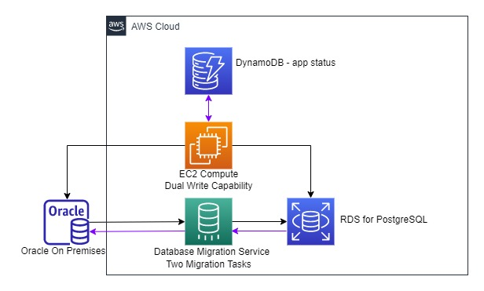

##DMS 2WAY Replication Proof of Concept

At AWS, we talk a lot about 2 way doors - in business, speed matters. Most decisions are not 1 way doors but 2 way doors - you can make the decision to walk through the door and walk right back if it doesn't work out. This is also an important mental model when it comes to database migrations. The scripts here are meant to help you build a 2 way door when it comes to database migrations. In this case, we use two DMS migration tasks to replicate data forward for a migration, but also backwards in case you need to failback.

Also included is a python script to act as a database 'client'. This script reads from a DynamoDB table that stores database endpoint information - depending on an input parameter, SITEA or SITEB, the client will either insert to an Oracle or PostgreSQL database. Consider this an easy way to track which site has migrated.

There are also infrastructure set up scripts included for:
- DynamoDB 
- Objects for Oracle and PostgreSQL
- DMS cli commands for a replication instance, database endpoints and migration tasks.

Below is the sample architecture:



## Set up DynamoDB 
- 1.cr8.ddb.appmap.py - create a DynamoDB table to store appmap information
- 2.ins.dyn.appmap.py - load a DynamoDB table called appmap with application id and database endpoint information

## Set up your databases
- Set up RDBMS source and target. In this case, we use Oracle as the old database and PostgreSQL as the new database we are migrating to.
Create your databases/users/schemas/tablespaces/etc. Then run the appropriate script:
  - 3.cr8.ora.heart.sql - create an example heartbeat table in oracle
  - 3.cr8.pg.heart.sql - create an example heartbeat table in postgresql
  - Make sure to run all the appropriate permissions for using Oracle as a source and PostgreSQL as a target.

Note: Sequences are not replicated with DMS. Therefore each site has a unique starting value.

## Set up DMS
Set up the DMS instance, database endpoints and the migration tasks. Make sure you edit the appropriate arns.

- 4.cr8.dms.repinstance.cli - set up a replication instance
- 5.cr8.dms.endpts.cli - set up source and target database endpoints
- 6.cr8.dms.migtaskfwd.cli - create forward migration task
- 7.cr8.dms.migtaskbck.cli - create backward migration task
- Turn on the migration tasks and check for errors. If you run into errors, you may need to increase the level of logging.

## Run the app
To run the simulated app:
```
python3 appinsert.v3.py SITEA|SITEB
```

## History
2022-07-14
- Added Architecture diagram

2022-06-30
- Cleanup
- Added DMS CLI setup scripts - rep instance, endpoints, migration task

2022-06-17
- Read from DynamoDB table based on input parameter
- Get engine
- Insert and Query latest based on which engine, inserting respective SITE
- Note that DMS migration tasks are not in this repo
- ins.dyn.appmap.py - loads appmap DDB table
- scan.dyn.appmap.cli - query appmap DDB table


- Heartbeat table, Unique index, Sequence
- Driver script to load data based on either SITEA or SITEB as an input parameter
- appmap - mapping file for database connection info based on site
- v2 - loaded appmap data into a dynamodb table - see ins.ddb.appmap.py


