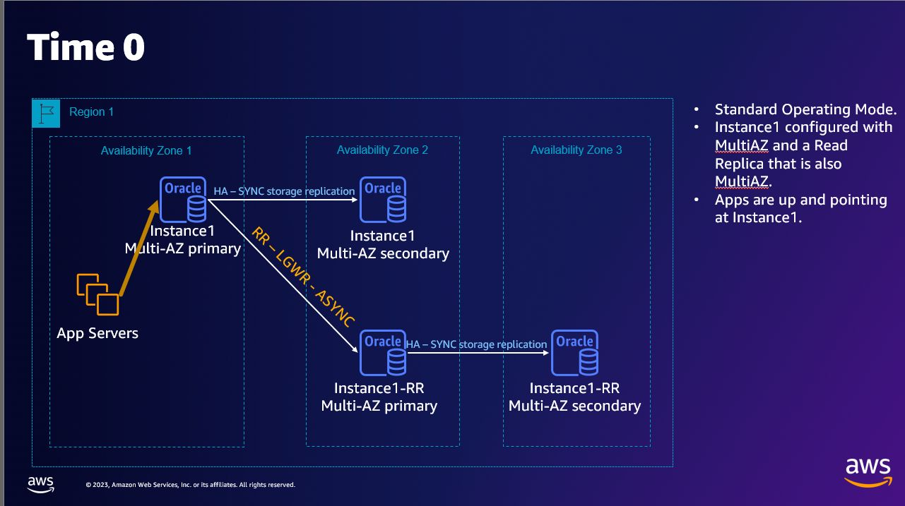
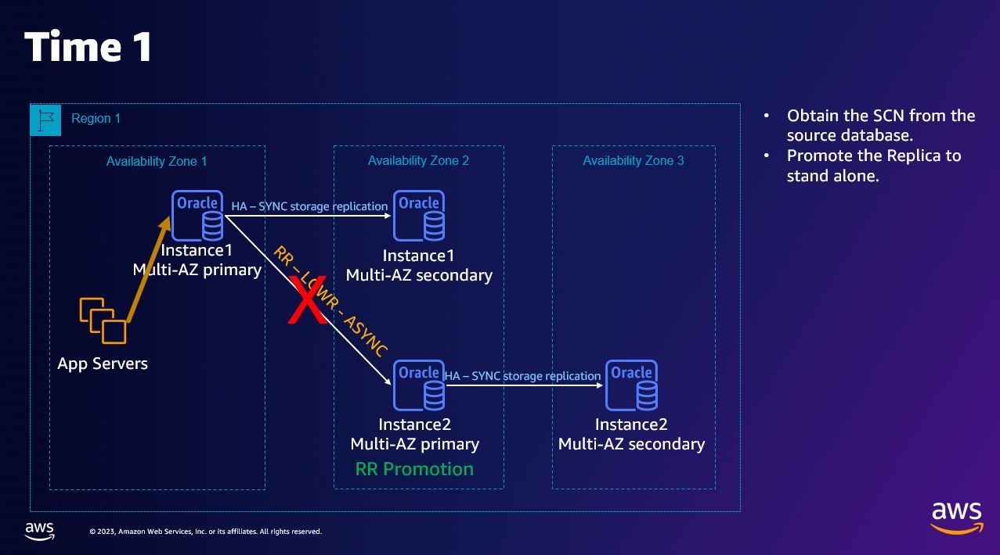
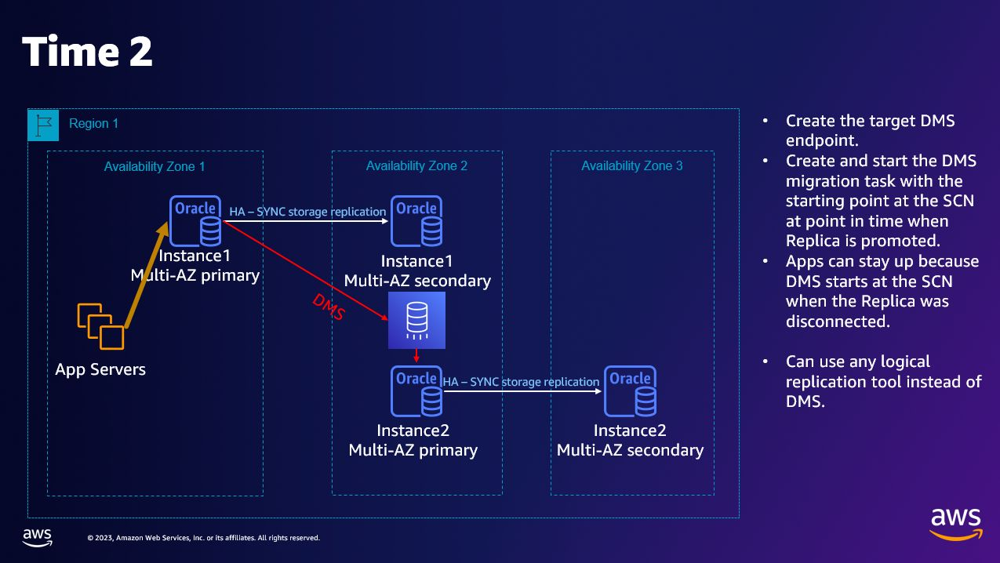
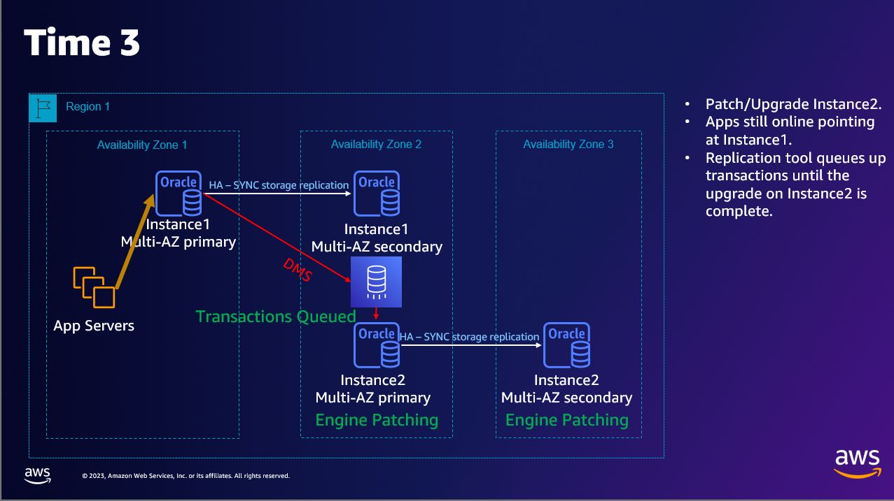
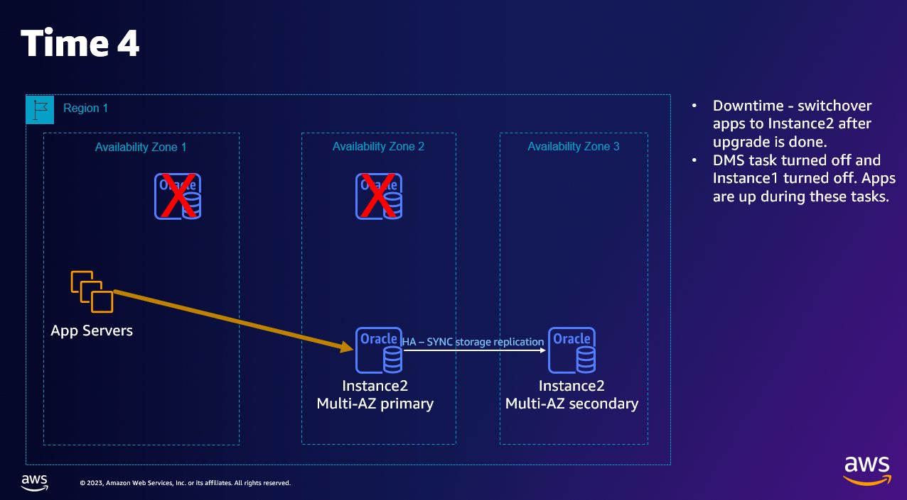
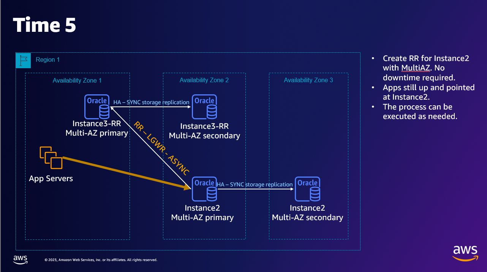

## Intro
RDS databases provide a high availability solution with MultiAZ configurations. With these configurations, a standby database is kept in sync with a primary database via replication at the storage layer. Although this meets most high availability requirements, database engine patches are applied to both the primary and standby databases at the same time, which some customers may have issues with.

In this post, we discuss using the combination of promoting RDS Read Replicas and turning on Change Data Capture (CDC) at a certain transaction with the Database Migration Service (DMS). This allows us to keep transactions replicating from a source database to a standalone promoted former read replica which can then be brought offline as needed. This combination can provide a higher level of flexibility for database availability.

## Solution Overview
RDS for Oracle databases can have up to 5 read replica databases and read replicas are a great solution to help scale load for read only transactions away from primary writer databases. Read replicas typically have latency of less than five seconds and are kept in sync with primary databases through Oracle Data Guard technology. Read replicas can also be configured to be MultiAZ just like primary databases. In this solution, we leverage read replicas because they are in sync with our primary database.

Most relational databases have pointers within their transaction logs to point to a position in the log or a marker for transactions. Oracle is no different and their pointers is called the System Change Number (SCN).  Most logical replication tools can start replicating data using the SCN and we will use this SCN to start CDC replication.

DMS can also queue transactions from source to target databases.

### Prerequisites
1. A source database that is healthy. The source database has already been configured to be a source and target for DMS.
2. A read replica database that is healthy. 
3. Latency between the source and replica database is low.
4. A DMS Replication instance that is already provisioned and healthy.
5. A DMS Source endpoint configured for the source database. Note that the endpoint should have already been tested.

