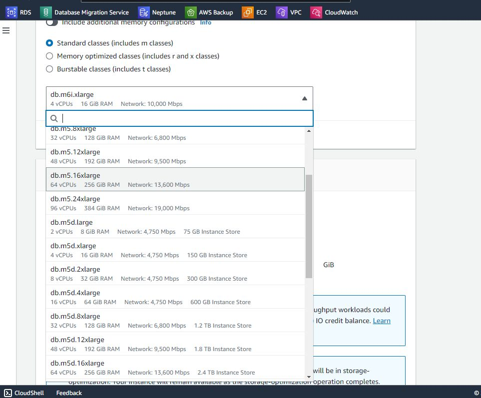

## Instance Stores for RDS for Oracle
1. Create the instance - note the instance shapes that have instance stores available and choose one of them.


2. Create a parameter group that has the rds.instance_store_temp_size set. Note that you can also configure a flash cache in the instance store with parameter group settings - see the documentation for instructions.

3. Assign the instance to the parameter group. Reboot the instance. Ensure the parameter group is in sync.

4. Confirm the default temp tablespace and wehre the temp data files are located.
```
ADMIN/ttsora90> select file_name, tablespace_name from dba_temp_files;

FILE_NAME
--------------------------------------------------------------------------------
TABLESPACE_NAME
------------------------------
/rdsdbdata/db/TTSORA90_A/datafile/o1_mf_temp_lqgn0v31_.tmp
TEMP


ADMIN/ttsora90> SELECT PROPERTY_VALUE
FROM DATABASE_PROPERTIES
WHERE PROPERTY_NAME = 'DEFAULT_TEMP_TABLESPACE';
  2    3
PROPERTY_VALUE
--------------------------------------------------------------------------------
TEMP
```
5. Create a new temp instance store. 
```
ADMIN/ttsora90> EXEC rdsadmin.rdsadmin_util.create_inst_store_tmp_tblspace(p_tablespace_name => 'temp01');

PL/SQL procedure successfully completed.
```
6. Alter the default temp tablespace to the tablespace that was just created.
```
ADMIN/ttsora90> EXEC rdsadmin.rdsadmin_util.alter_default_temp_tablespace(tablespace_name => 'temp01');

PL/SQL procedure successfully completed.

```
7. Reconfirm the default temp tablespace and wehre the temp data files are located. Note the different filesystem - this is the NVMe storage volume on this RDS host.
```
ADMIN/ttsora90> select file_name, tablespace_name from dba_temp_files;

FILE_NAME
--------------------------------------------------------------------------------
TABLESPACE_NAME
------------------------------
/rdsdbdata/db/TTSORA90_A/datafile/o1_mf_temp_lqgn0v31_.tmp
TEMP

/rdslocalstorage/rds_inst_store_tempfile_TTSORA90.tmp
TEMP01


ADMIN/ttsora90> SELECT PROPERTY_VALUE
FROM DATABASE_PROPERTIES
WHERE PROPERTY_NAME = 'DEFAULT_TEMP_TABLESPACE';
  2    3
PROPERTY_VALUE
--------------------------------------------------------------------------------
TEMP01
```

## References
- https://docs.aws.amazon.com/AmazonRDS/latest/UserGuide/CHAP_Oracle.advanced-features.instance-store.html


