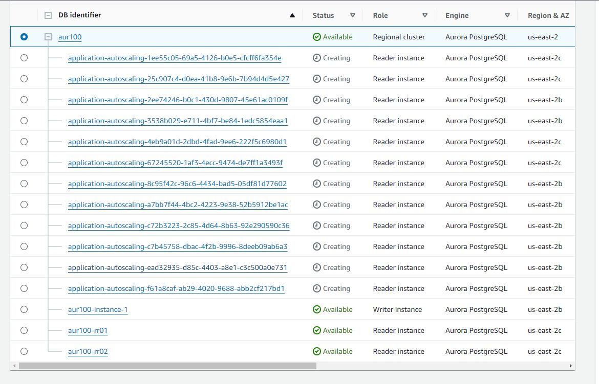
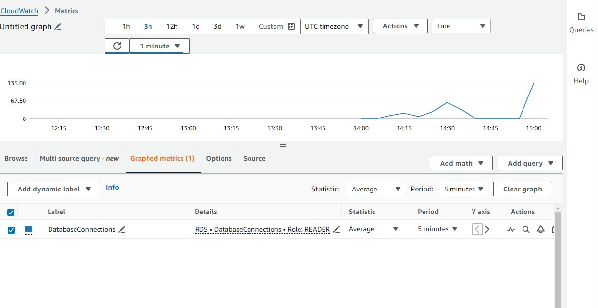
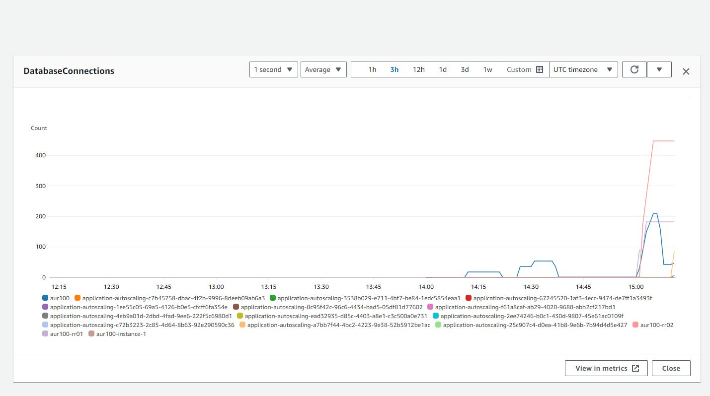
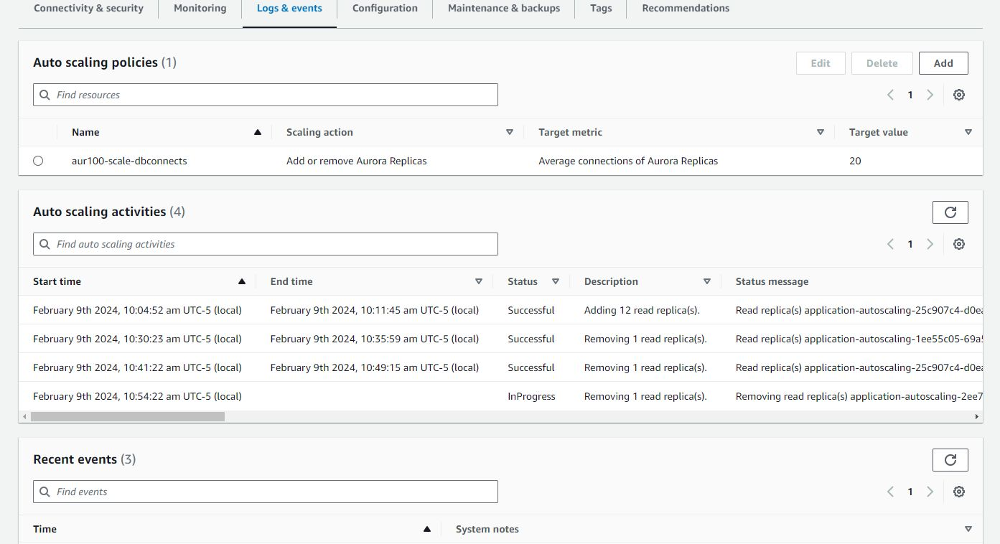

##
- create an aurora cluster
  - single writer, two readers
- script that can generate a few database connections
  - pg bench 
  - point at reader endpoint
  - transaction file is a select only
- watch cloud metrics

##

##

- For each aurora db cluster, you can create only one auto scaling policy for each target metric

- The scaling policy adds or removes Aurora Replicas as required to keep the metric at, or close to, the specified target value.
In addition to keeping the metric close to the target value, a target-tracking scaling policy also adjusts to
fluctuations in the metric due to a changing workload. Such a policy also minimizes rapid fluctuations in the number of
available Aurora Replicas for your DB cluster.

keep the metric at or close to the target value
- Example: 200 connections average across the cluster

## Adding replicas

## CloudWatch metrics
Note that the first image is the exact metric the policy is monitoring. The second image is database connections average by the second.

## Scaling In

